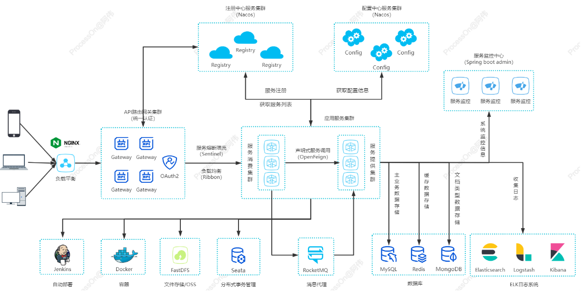
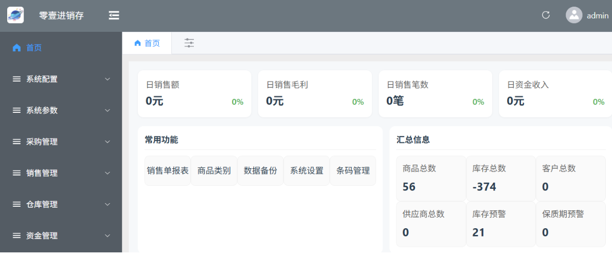
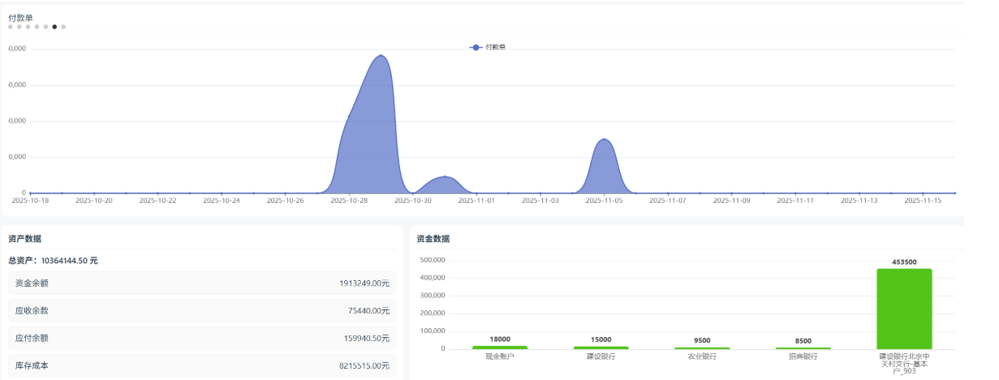
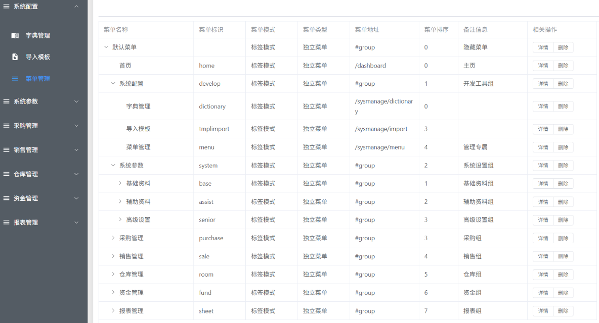
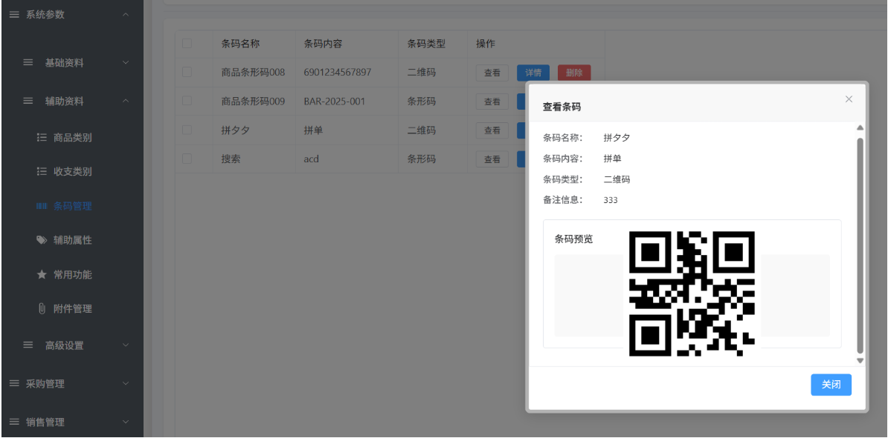
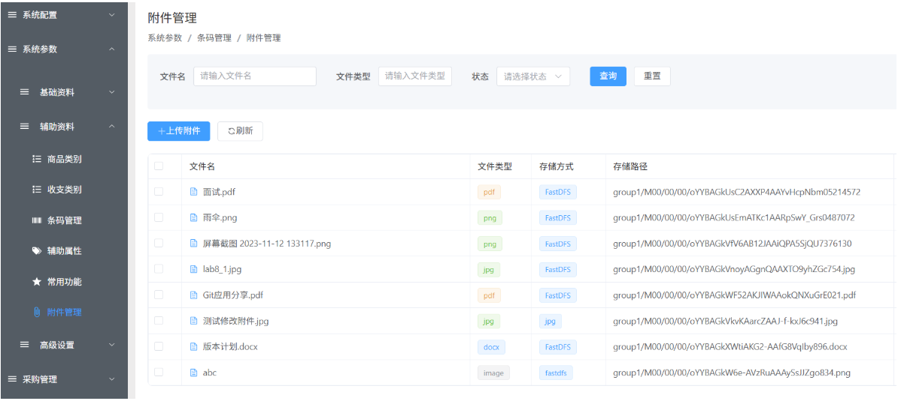
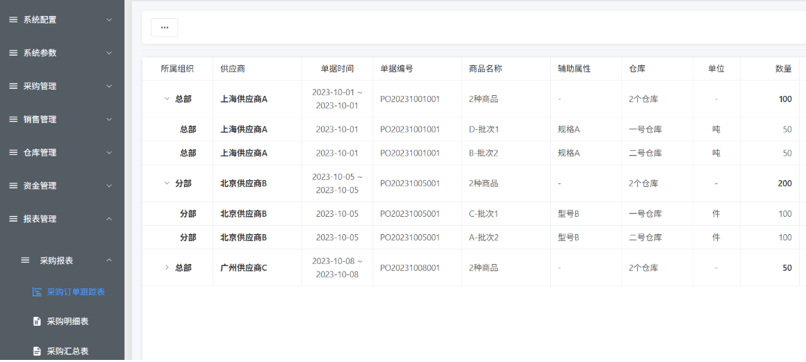

# `zero-one-psi`

进销存相关概念参考：

- https://wiki.mbalib.com/wiki/%E8%BF%9B%E9%94%80%E5%AD%98
- https://baike.baidu.com/item/%E8%BF%9B%E9%94%80%E5%AD%98/7151671

## 项目简介

**`zero-one-psisys`**是一款面向中小企业，高效、省心、高性价比的在线进销存(purchasing, sales, inventory)管理系统，系统满足不同行业需求，是促进企业发展的重要组成部分，是企业经营管理中的重要环节。

项目特点：操作简单、上网就能查库存、下销售单、采购管理、库存管理、库存管理/仓库管理等，一应俱全；库存集中管理，管理员可以给不同的人员分配不同的数据权限和功能权限；智能补货，保证库存充足，价格记忆，避免报价混乱，一键成本重算，解决多批次产品库存成本不同的问题；进销存单据自动生成记账凭证，实现进销存软件与财务软件无缝对接。

功能蓝图：采购管理、库存管理、销售管理、收付款管理、基础资料、业务监控等。

## 系统架构图

项目主体骨架基于`Spring Cloud Alibaba`生态体系，使用`MySQL`进行数据持久化管理，采用`Vue3`生态体系与`Element Puls UI`框架完成前端制作，同时项目提供微服务开发解决方案与集成。

## 项目结构说明
> `zero-one-psi`  
>
> > `.gitignore` -- 忽略提交配置
> >
> > `README.md` -- 项目自述文件
> >
> > `documents` -- 环境搭建、编码规范、项目需求等等文档资源
> >
> > `psi-java` -- `Java`项目主体
> >
> > `psi-frontend` -- 前端项目主体

## 软件架构

### `Java`技术栈

#### 后端核心技术栈

版本匹配参考：

https://github.com/alibaba/spring-cloud-alibaba/wiki/%E7%89%88%E6%9C%AC%E8%AF%B4%E6%98%8E

| 技术                     | 说明                   | 版本          | 备注                                                         |
| ------------------------ | ---------------------- | ------------- | ------------------------------------------------------------ |
| `Spring`                 | 容器                   | 5.2.15        | https://spring.io/                                           |
| `Spring Web MVC`         | `MVC`框架              | 5.2.15        | https://docs.spring.io/spring/docs/current/spring-framework-reference/web.html |
| `Beanvalidation`         | 实体属性校验           | 2.0.2         | https://beanvalidation.org/2.0-jsr380/ https://www.baeldung.com/spring-boot-bean-validation |
| `MyBatis`                | `ORM`框架              | 3.5.7         | http://www.mybatis.org/mybatis-3/zh/index.html               |
| `MyBatis Plus`           | `MyBatis`的增强工具    | 3.4.3.4       | https://baomidou.com/                                        |
| `MyBatis Plus Generator` | 代码生成器             | 3.5.1         | https://github.com/baomidou/generator                        |
| `Druid`                  | 数据库连接池           | 1.2.8         | https://github.com/alibaba/druid                             |
| `Lombok`                 | 实体类增加工具         | 1.18.20       | https://github.com/rzwitserloot/lombok                       |
| `Hutool`                 | Java工具类库           | 5.8.3         | https://hutool.cn/docs/#/                                    |
| `Knife4j`                | 接口描述语言           | 2.0.8         | https://gitee.com/xiaoym/knife4j                             |
| `Nimbus JOSE JWT`        | `JSON Web Token`       | 8.21          | https://bitbucket.org/connect2id/nimbus-jose-jwt/wiki/Home   |
| `Spring Boot`            | Spring快速集成脚手架   | 2.3.12        | https://spring.io/projects/spring-boot                       |
| `Spring Cloud`           | 微服务框架             | `Hoxton.SR12` | https://spring.io/projects/spring-cloud                      |
| `Spring Cloud Alibaba`   | 微服务框架             | 2.2.8         | https://github.com/alibaba/spring-cloud-alibaba/wiki         |
| `Spring Cloud Security`  | 认证和授权框架         | 2.2.5         | https://spring.io/projects/spring-cloud-security             |
| `Sentinel`               | 分布式系统的流量防卫兵 | 1.8.4         | https://sentinelguard.io/zh-cn/                              |
| `Seata`                  | 分布式事务解决方案     | 1.5.1         | https://seata.io/zh-cn/                                      |
| `MapStruct`              | 实体类映射代码生成器   | `1.5.3.Final` | https://mapstruct.org/                                       |

#### 后端扩展技术栈

版本匹配参考：

https://docs.spring.io/spring-data/elasticsearch/docs/current/reference/html/#preface.requirements

https://docs.spring.io/spring-data/mongodb/docs/current/reference/html/#requirements

| 技术                       | 说明                   | 版本   | 备注                                                         |
| -------------------------- | ---------------------- | ------ | ------------------------------------------------------------ |
| `EasyExcel`                | Excel报表              | 3.0.5  | https://github.com/alibaba/easyexcel                         |
| `RocketMQ`                 | 消息队列中间件         | 4.9.3  | https://github.com/alibaba/spring-cloud-alibaba/wiki/RocketMQ |
| `WebSocket`                | 及时通讯服务           | 5.2.15 | https://docs.spring.io/spring-framework/docs/5.3.15/reference/html/web.html#websocket |
| `FastDFS`                  | `dfs`客户端            | 2.0.1  | https://gitee.com/zero-awei/fastdfs-spring-boot-starter      |
| `Elasticsearch`            | 分布式搜索和分析引擎   | 7.6.2  | https://www.elastic.co/guide/en/elasticsearch/reference/7.6/index.html |
| `LogStash`                 | 日志收集工具           | 7.6.2  | https://www.elastic.co/guide/en/logstash/7.6/index.html      |
| `Kibana`                   | 日志可视化查看工具     | 7.6.2  | https://www.elastic.co/guide/en/kibana/7.6/index.html        |
| `logstash-logback-encoder` | `Logstash`日志收集插件 | 6.6    | https://github.com/logfellow/logstash-logback-encoder/tree/logstash-logback-encoder-6.6 |
| `spring-boot-admin`        | 服务管理和监控面板     | 2.3.1  | https://github.com/codecentric/spring-boot-admin             |
| `EasyEs`                   | `ES ORM`开发框架       | 1.0.3  | https://www.easy-es.cn/                                      |
| `spring-data-mongodb`      | `Spring`集成`MongoDB`  | 3.0.9  | https://docs.spring.io/spring-data/mongodb/docs/3.0.9.RELEASE/reference/html/#preface |
| `AJ-Captcha`               | 验证码插件             | 1.3.0  | https://ajcaptcha.beliefteam.cn/captcha-doc/                 |
| `x-easypdf`                | `pdf`插件              | 2.12.2 | https://gitee.com/dromara/x-easypdf                          |

### 前端技术栈

#### 核心技术栈

| 技术           | 说明             | 版本                                                         | 备注                                 |
| -------------- | ---------------- | ------------------------------------------------------------ | ------------------------------------ |
| `Vue`          | 前端框架         | `v3.x`                                                       | https://v3.vuejs.org/                |
| `Vue-Router`   | 路由框架         | `v4.x`                                                       | https://next.router.vuejs.org/       |
| `Pinia`        | 全局状态管理框架 | `v2.x`                                                       | https://pinia.vuejs.org/             |
| `Axios`        | HTTP中间件       | [v1.7.2](https://github.com/axios/axios/releases/tag/v1.7.2) | https://github.com/axios/axios       |
| `Element-Plus` | 前端`UI`框架     | `latest`                                                     | https://element-plus.gitee.io/zh-CN/ |

#### 扩展技术栈

| 技术                 | 说明          | 版本   | 备注                                                         |
| -------------------- | ------------- | ------ | ------------------------------------------------------------ |
| `ECharts`            | 图表框架      | latest | [`Apache ECharts`](https://echarts.apache.org/handbook/zh/get-started/) |
| `AJ-Captcha`         | 验证码插件    | 1.3.0  | https://ajcaptcha.beliefteam.cn/captcha-doc/                 |
| `SheetJS`            | 电子表格插件  | 0.20.2 | https://docs.sheetjs.com/docs/ https://docs.sheetjs.com/docs/demos/frontend/vue |
| `vue-plugin-hiprint` | 打印插件      | 0.0.56 | https://gitee.com/CcSimple/vue-plugin-hiprint                |
| `wangEditor`         | 富文本编辑器  | v5     | https://www.wangeditor.com/v5/                               |
| `pdfobject`          | `pdf`预览插件 | 2.3.0  | https://github.com/pipwerks/PDFObject                        |
| `Vitest`             | 测试框架      | 1.6.0  | https://cn.vitest.dev/ https://cn.vuejs.org/guide/scaling-up/testing.html |
| `pinyin-pro`         | 汉字转拼音库  | latest | https://pinyin-pro.cn/                                       |

### 

## 环境要求

### 开发工具

| 工具            | 说明                  | 版本      | 备注                                                         |
| --------------- | --------------------- | --------- | ------------------------------------------------------------ |
| `Navicat`       | 数据库连接工具        | latest    | https://www.navicat.com.cn/                                  |
| `RDM`           | `Redis`可视化管理工具 | latest    | https://github.com/uglide/RedisDesktopManager https://gitee.com/qishibo/AnotherRedisDesktopManager |
| `PowerDesigner` | 数据库设计工具        | 16.6      | http://powerdesigner.de/                                     |
| `Axure`         | 原型设计工具          | 9         | https://www.axure.com/                                       |
| `MindMaster`    | 思维导图设计工具      | latest    | http://www.edrawsoft.cn/mindmaster                           |
| `Visio`         | 流程图绘制工具        | latest    | https://www.microsoft.com/zh-cn/microsoft-365/visio/flowchart-software |
| `Apifox`        | `API`接口调试工具     | latest    | https://apifox.com/                                          |
| `Mock.js`       | `API`接口模拟测试     | latest    | http://mockjs.com/                                           |
| `Git`           | 项目版本管控工具      | latest    | https://git-scm.com/                                         |
| `Codeup`        | 项目源码托管平台      | latest    | https://codeup.aliyun.com                                    |
| `Projex`        | 开发过程管控平台      | latest    | https://devops.aliyun.com/projex                             |
| `IDEA`          | `Java`开发`IDE`       | 2022.1.3+ | https://www.jetbrains.com/idea/download                      |
| `Apache Maven`  | Maven 构建工具        | 3.6.3     | https://maven.apache.org/                                    |
| `Docker Maven`  | Maven Docker插件      | 0.40.2    | https://dmp.fabric8.io/ https://github.com/fabric8io/docker-maven-plugin |
| gtest           | 测试框架              | 1.14.0    | https://github.com/google/googletest                         |
| `VS Code`       | 前端开发`IDE`         | latest    | https://code.visualstudio.com/Download                       |

### 开发环境

| 依赖环境  | 版本       | 备注                      |
| --------- | ---------- | ------------------------- |
| `Windows` | 10+        | 操作系统                  |
| `JDK`     | 1.8.0_191+ | https://www.injdk.cn/     |
| `NodeJS`  | 20.15.0    | https://nodejs.org/zh-cn/ |
| `NPM`     | 8.19.2     | https://www.npmjs.com/    |

### 服务器环境

| 依赖环境    | 版本                                                         | 备注                                                         |
| ----------- | ------------------------------------------------------------ | ------------------------------------------------------------ |
| `Anolis OS` | `8.6GA`                                                      | https://openanolis.cn/anolisos                               |
| `Docker`    | latest                                                       | https://www.docker.com/                                      |
| `MySQL`     | 8.0.20                                                       | https://www.mysql.com/cn/                                    |
| `Redis`     | 6.2.7                                                        | https://redis.io/                                            |
| `Nacos`     | 2.1.0                                                        | https://nacos.io/zh-cn/docs/quick-start-docker.html          |
| `Sentinel`  | 1.8.4                                                        | https://github.com/alibaba/Sentinel/releases                 |
| `Seata`     | 1.5.1                                                        | https://github.com/seata/seata                               |
| `RocketMQ`  | 4.9.3                                                        | https://rocketmq.apache.org/                                 |
| `Nginx`     | latest                                                       | https://nginx.org/en/                                        |
| `FastDFS`   | [V6.07](https://github.com/happyfish100/fastdfs/releases/tag/V6.07) | https://gitee.com/fastdfs100                                 |
| `ELK`       | 7.6.2                                                        | https://www.elastic.co/guide/en/elastic-stack/7.6/index.html |
| `MongoDB`   | 4.4.17                                                       | https://www.mongodb.com/try/download/community               |
| `Jenkins`   | latest                                                       | https://www.jenkins.io/zh/doc/book/installing/               |

## 部分功能预览图

## 特别鸣谢

`zero-one-psi`的诞生离不开开源软件和社区的支持，感谢以下开源项目及项目维护者：

- `spring`：https://github.com/spring-projects
- `alibaba`：https://github.com/alibaba
- `mybatis`：https://github.com/mybatis/mybatis-3.git
- `mp`：https://github.com/baomidou
- `api`：https://gitee.com/xiaoym/knife4j
- `vue`：https://github.com/vuejs
- `ui`：https://github.com/ElemeFE
- `oatpp`：https://github.com/oatpp/oatpp

同时也感谢其他没有明确写出来的开源组件提供给与维护者。
